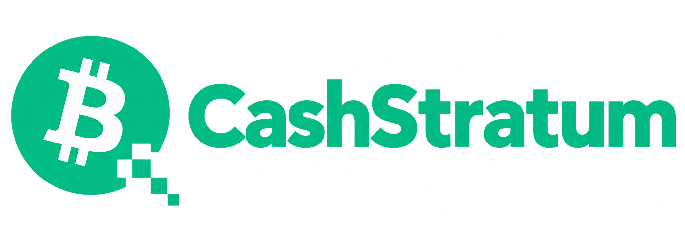

# Mining infrastructure for Bitcoin Cash

**A BCH-focused Stratum server and solo mining pool engine, built on CKPool.**

Direct miner payouts · Native CashAddr · Per-address round statistics · Operator tooling

[Releases](https://github.com/cashstratum/cashstratum/releases) · [Contribute](CONTRIBUTING.md) · [Report an issue](https://github.com/cashstratum/cashstratum/issues) · [cashstratum.com](https://cashstratum.com)

## Release status

**The first CashStratum source release is being prepared. This repository currently contains
project documentation, not an installable mining engine.**

CashStratum grows out of the BCH fork previously published as [skaisser/ckpool](https://github.com/skaisser/ckpool).
That remains the existing public source while the next release is integrated, tested and
rebranded. Features described below cover the development line intended for CashStratum;
consult the release notes of the version you actually deploy.

Watch **Releases** on this repository for the first tagged source release. It will include the
engine, build instructions, tests and operator documentation. No release date is promised.

## Built for BCH operators

| Capability | What it provides |
|---|---|
| **Native CashAddr** | BCH address parsing and payout-script construction, with network and checksum validation. |
| **Direct solo payouts** | In per-address solo mode, the winning miner's address receives its share of the reward in the block's coinbase transaction. |
| **Operator fee** | A configurable fee output alongside the miner's payout. |
| **Per-address rounds** | Separate round-share and luck statistics for each payout identity; one miner's solve does not reset everyone else's round. |
| **Rental compatibility** | Difficulty handling for NiceHash and MiningRigRentals, alongside conventional ASIC clients. |
| **Node resilience** | Multi-node RPC/ZMQ integration and failover handling. |
| **Go operator API** | Read-only access to pool statistics, miner records, shares, coinbase details and block-find logs. |
| **Browser latency probe** | A lightweight `/ping` endpoint for measuring HTTP round-trip time to the API host. |
| **Terminal monitoring** | A custom `monitor.sh` view highlighting pool events, shares, hashrate and block discoveries. |

The API's latency probe measures the HTTP path. It is not a measurement of Stratum job-delivery
latency, ASIC performance or block-propagation speed.

## How direct payouts work

A miner connects using a BCH payout address, optionally followed by a worker suffix. In
per-address solo mode, that identity determines the miner output in the coinbase. When the
miner finds an accepted block, the reward goes directly to that address, less the configured
operator fee. Coinbase rewards remain subject to network maturity rules.

This avoids an operator-managed withdrawal balance for that solo payout. It does not imply a
PPS guarantee or a shared-reward accounting system. Username fallback and address-rejection
rules will be documented with the released configuration.

## C engine, Go API, shell tooling

The mining engine retains CKPool's C foundation and cooperating connector, generator and
Stratum-processing components. The Go API supplies operator-facing read access; it does not
replace the mining engine. Shell tools support installation and terminal monitoring.

Authenticated API routes expose operational data. The lightweight `/ping` route is deliberately
unauthenticated and separately rate-limited. Deployment documentation will explain network
boundaries and TLS configuration before public installation instructions are published.

The first release will document CashStratum binary, configuration, service and log names,
including migration from existing CKPool-based installations. Do not rename files in a running
installation without updating their consumers.

## Production lineage and evidence

The maintainers report **68+ BCH mainnet blocks** from the predecessor deployment operated as
BlockSniper / EloPool. That is the project's operational history, not a claim that a CashStratum
release has already shipped or a benchmark against other pool engines.

The evidence collection under [docs/proofs/](docs/proofs/) is being prepared. Published entries
will pair block heights and explorer links with relevant, sanitized operational records.
On-chain data can verify a block and its coinbase outputs; it cannot by itself identify the
software build that produced it. Hashrate and timing claims require their own measurements.

CashStratum is the software. BlockSniper is a reference deployment. Other operators can run
the engine under their own pool name and branding.

## Join the project

We welcome reproducible bug reports, payout and address-validation regression cases, ASIC and
rental compatibility reports, documentation improvements, and performance measurements with
commands and hardware details.

- Read [CONTRIBUTING.md](CONTRIBUTING.md) before opening a pull request.
- Follow [SECURITY.md](SECURITY.md) for privately reporting security issues.
- To propose a pool listing, use the [Add your pool](https://github.com/cashstratum/cashstratum/issues/new?template=add-your-pool.yml) issue template. Listings require verification.

## License and acknowledgments

**GNU GPL version 3 or later** — see [COPYING](COPYING).

CashStratum is derived from **CKPool by Con Kolivas and its contributors**. Their work remains
an essential part of this engine. BCH development originated in the BlockSniper / EloPool fork
and continues here with community contributions. Original copyright and license notices are
retained; the CashStratum name identifies this project's maintenance and BCH direction.
